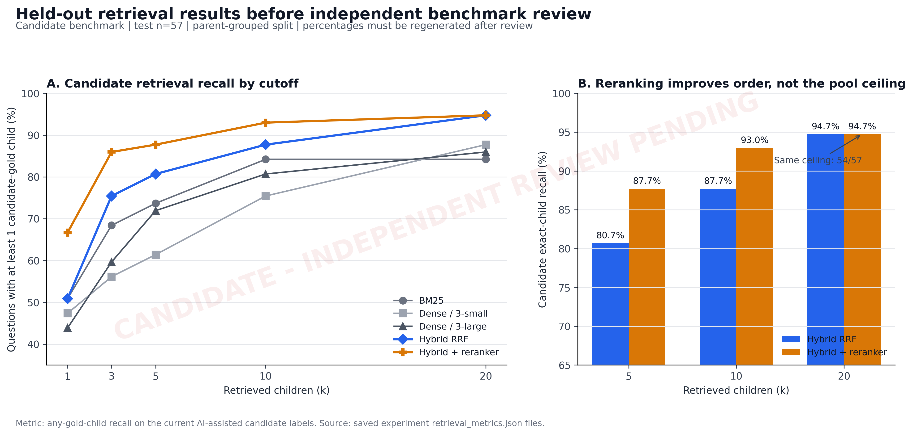

# Supervisor Meeting Pack - 29 July 2026

**Project:** Citation-grounded question answering over EU aviation regulations  
**Meeting objective:** Agree the evaluation protocol and the smallest justified path from retrieval to a defensible end-to-end RAG result.

> Mandatory pre-meeting task: complete or assign the 33-row independent benchmark review in data/evaluation/independent_review_v1/review_queue.csv.

## Repository status - 25 July 2026

- E1-E4 candidate retrieval and reranking runs are complete and reproducible.
- Both E5 context variants are complete; no answer generation has run.
- D023/D024 establish a bilingual multi-reviewer panel and pre-registered aggregation rule.
- The live collection form and aggregation tool exist, but the repository queue remains 0/33 decided until responses are exported and adjudicated.
- Chapter 2, Chapter 4, and the bibliography were expanded for reuse in the final mémoire.
- This file is the complete slide narrative; an actual PPTX is not yet stored in the repository.

## Slide 1 - Where RAG breaks, and what should happen next

Visible copy:

**Where RAG breaks, and what should happen next**

Citation-grounded QA over EU aviation regulations  
Progress and decisions for 29 July 2026

Speaker note:

The project has moved from a three-system leaderboard to a failure-and-escalation study. This meeting should approve the benchmark validity gate and the remaining experiment scope.

## Slide 2 - The research contribution is now an escalation policy

Visible copy:

**The useful question is not "which system wins?"**

Baseline question  
Which performs best: few-shot, RAG, or LoRA?

Reframed question  
Where does retrieval-grounded QA fail, and which observable condition justifies reranking, retrieval expansion, clarification, or human review?

Target contribution  
Use the simplest intervention that recovers the failure; do not apply an agent to every question.

Speaker note:

This directly combines the earlier supervisor feedback about the RAG ceiling and switching point with the later requests for parent-child chunking, larger embeddings, hybrid retrieval, and reranking.

## Slide 3 - The original ceiling was confounded

Visible copy:

**The historical RAG score mixed system failure with data defects**

43/100  
Exact citation plus content threshold

82/100  
Designated legacy chunk retrieved

But the baseline also contained:

- flat chunks up to 30,275 characters;
- fixed 1,500-character context truncation;
- parser and document-identity defects;
- unchecked synthetic gold answers;
- article-level partial citations counted as 0.5.

Conclusion  
The original result is a baseline, not a clean intrinsic RAG ceiling.

Speaker note:

The 63/100 loose proxy must not be presented as exact correctness. The repaired pipeline isolates retrieval and evidence errors before another answer-generation comparison.

## Slide 4 - The repaired benchmark makes failures traceable

Visible copy:

**Every candidate answer is now linked to exact legal evidence**

109  
Legal parent units

1,535  
Retrievable child units

99  
Retained candidate questions

42 / 57  
Parent-grouped development / test split

Zero parent leakage

21 records corrected; 1 invalid record excluded

Speaker note:

The corpus preserves articles, annexes, guidance, tables, canonical citations, and source lineage. The 99-question set is still AI-assisted candidate gold; the independent review is the remaining validity gate.

## Slide 5 - A larger embedding helps, but lexical retrieval still matters

Visible copy:

**Embedding capacity alone does not remove the retrieval ceiling**

Development exact-child recall:

| Retriever | k=5 | k=10 |
|---|---:|---:|
| text-embedding-3-small | 66.7% | 76.2% |
| text-embedding-3-large | 69.0% | 78.6% |
| BM25 | 76.2% | 81.0% |
| Hybrid RRF | 76.2% | 88.1% |

Decision  
Select text-embedding-3-large for dense retrieval, but combine it with BM25.

Speaker note:

The model choice was made on development before opening the test comparison. BM25's strength reflects exact terminology, article references, and repeated regulatory language.

## Slide 6 - Hybrid retrieval expands the recoverable candidate pool

Visible copy:

**Hybrid retrieval finds selected evidence for 54 of 57 test questions**

| Candidate depth | Dense large | BM25 | Hybrid |
|---:|---:|---:|---:|
| k=5 | 71.9% | 73.7% | **80.7%** |
| k=10 | 80.7% | 84.2% | **87.7%** |
| k=20 | 86.0% | 84.2% | **94.7%** |

Interpretation  
Retrieve broadly with two complementary channels. Do not send all 20 candidates directly to generation.

Speaker note:

Equal-weight RRF with a fixed constant of 60 is reproducible and was not tuned on test. The top-20 result defines the candidate-generation ceiling for the current benchmark.

## Slide 7 - Local reranking turns candidate recall into usable context

Visible copy:

**Reranking moves relevant evidence into a five-child context**

Held-out exact-child recall:

| Depth | Hybrid | + Cross-encoder |
|---:|---:|---:|
| k=1 | 50.9% | **66.7%** |
| k=3 | 75.4% | **86.0%** |
| k=5 | 80.7% | **87.7%** |
| k=10 | 87.7% | **93.0%** |
| k=20 | 94.7% | 94.7% |

The reranker recovers ranking failures. It cannot recover evidence absent from the candidate pool.

*Candidate test comparison. Independent benchmark review pending; regenerate before final claims.*

Speaker note:

The 22.7M-parameter MiniLM cross-encoder ran locally on the RTX 4070. It scored 1,980 pairs without uploading project text. At test k=5 it recovers five hybrid misses and breaks one prior success.

## Slide 8 - The remaining "ceiling" contains three different problems

Visible copy:

**Three k=20 misses do not mean one common system failure**

QA_0063 - Clarify  
"What exceptions?" is too broad; multiple real exception provisions compete.

QA_0080 - Repair gold evidence  
Equivalent annex wording appears outside the single selected child.

QA_0176 - Improve retrieval  
A broad paraphrase does not uniquely identify the intended GM 3.1 evidence.

Conclusion  
The residual mixes ambiguity, benchmark incompleteness, and genuine retrieval failure.

Speaker note:

This is the central methodological finding. Independent review must separate false metric failures from real system failures before quoting a ceiling.

## Slide 9 - The switching point is observable and economical

Visible copy:

**Escalate only when the current evidence justifies it**

1. Hybrid candidate generation -> retrieve 20
2. Cross-encoder reranking -> select approximately 5
3. Evidence-constrained generation -> return source IDs
4. Verification -> check claim support and citations
5. Clarify or expand -> low confidence, disagreement, missing evidence
6. Abstain or human review -> ambiguity, conflict, unsupported answer
7. Agentic retrieval -> only for validated multi-step residuals

Speaker note:

Candidate presence versus absence provides the experimental distinction. Runtime triggers still need calibration using retrieval disagreement, score margin, query type, and verifier outcome, not unavailable gold labels.

## Slide 10 - Four decisions unblock the final experiments

Visible copy:

**Decisions requested on 29 July**

1. Confirm reviewer coverage, response deadline, and D024 adjudication ownership.
2. Confirm English-only evaluation or define the multilingual question.
3. Approve hybrid top-20 plus local reranker as the retrieval architecture.
4. Keep agentic RAG optional unless reviewed residuals require multi-step evidence.

Next output  
Frozen gold benchmark -> evidence-constrained answers -> verifier and abstention results -> switching-policy comparison.

Speaker note:

The immediate priority is not another model variant. It is freezing credible gold data and moving to end-to-end grounded-answer evaluation. Confirm who will provide the remaining panel coverage, who will adjudicate contested records, and the deadline for freezing the benchmark.

## Evidence sources

- reports/dense_hybrid_candidate_results.md
- reports/cross_encoder_rerank_candidate_results.md
- reports/legacy100_ai_audit.md
- reports/E1_corpus_audit.md
- docs/decision_log.md
- experiments/E1_dense_3small_candidate_v1
- experiments/E2_dense_3large_candidate_v1
- experiments/E3_hybrid_rrf_candidate_v1
- experiments/E4_cross_encoder_rerank_candidate_v1

## Presentation artifact status

The slide narrative and audience-facing copy are complete. Automatic PPTX materialization is currently blocked because the installed presentation plugin cannot find its required local @oai/artifact-tool runtime package. No substitute PowerPoint library was used because the presentation workflow explicitly requires that runtime.

When the runtime is repaired, this source maps directly to a ten-slide Codex Grid deck with two native charts, two evidence tables, one escalation flow, and a decision close.
